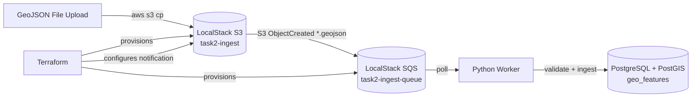

# Task 2 - Assignment B: LocalStack + Terraform + GeoJSON Worker

This project provides a fully local, reproducible AWS-like ingestion pipeline using LocalStack and PostGIS.

## Architecture



## Why this setup

- Uses `LocalStack` and local `PostGIS` to avoid AWS costs.
- Still demonstrates production-style practices: IaC with Terraform, containerized services, CI workflow, and integration testing.

## Project Structure

- `docker-compose.yml` - localstack + postgres/postgis + worker
- `run_all.ps1` - single entrypoint to start stack and run Terraform apply
- `verify.ps1` - end-to-end verification script
- `infra/terraform/` - S3, SQS, notification, IAM Terraform resources
- `worker/` - Python polling and ingestion service
- `tests/` - unit tests for GeoJSON parsing
- `scripts/integration_test.sh` - CI integration test
- `VERSION` - simple version strategy source

## Prerequisites

- Docker Desktop
- PowerShell
- Terraform in `PATH`
- AWS CLI in `PATH`

## Local Run

From `task-2`:

```powershell
$env:AWS_ACCESS_KEY_ID="test"
$env:AWS_SECRET_ACCESS_KEY="test"
$env:AWS_DEFAULT_REGION="us-east-1"
.\run_all.ps1
```

What `run_all.ps1` does:

1. `docker compose up -d --build`
2. Waits for `task2-localstack` and `task2-postgres` health
3. Runs Terraform:
   - `terraform -chdir=infra/terraform init`
   - `terraform -chdir=infra/terraform apply -auto-approve`
4. Prints next verification commands

## Verification

Run:

```powershell
.\verify.ps1
```

`verify.ps1` performs:

1. Creates and uploads `data/sample.geojson` to `s3://task2-ingest/sample.geojson`.
2. Verifies SQS message appears in `task2-ingest-queue`.
3. Starts worker and verifies rows are inserted in PostGIS (`geo_features`).

Manual checks:

```powershell
aws --endpoint-url=http://localhost:4566 s3 ls
aws --endpoint-url=http://localhost:4566 sqs list-queues
aws --endpoint-url=http://localhost:4566 s3api get-bucket-notification-configuration --bucket task2-ingest
docker exec task2-postgres psql -U geo -d geodb -c "SELECT id, source_key, ST_AsText(geom) FROM geo_features ORDER BY id DESC LIMIT 5;"
```

## Terraform Resources

`infra/terraform/main.tf` provisions:

- `aws_s3_bucket.task2-ingest`
- `aws_sqs_queue.task2-ingest-queue`
- `aws_sqs_queue_policy` for S3 send permissions
- `aws_s3_bucket_notification` with suffix filter `.geojson`
- minimal IAM role/policy resources for worker access pattern

Provider endpoints are configured for LocalStack (`http://localhost:4566`) in `infra/terraform/providers.tf`.

## CI/CD (GitHub Actions)

Workflow: `.github/workflows/ci.yml` (push to `main`)

Steps:

1. Lint (`ruff`) and unit tests (`pytest`)
2. Build worker image tagged with `task-2/VERSION`
3. Run full integration test with docker-compose + terraform + sample upload + DB assertion
4. Version strategy: uses `VERSION` file and creates git tag `vX.Y.Z` if missing

## Cleanup

```powershell
docker compose down -v
```